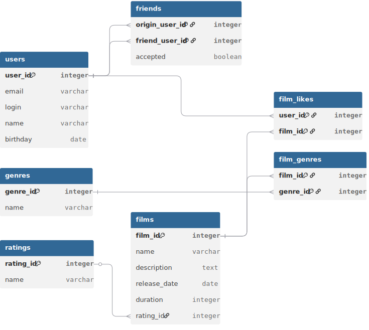

# java-filmorate
Template repository for Filmorate project.

---

## Структура БД

Приложение **Filmorate** хранит данные в базе данных. Предпочтительная СУБД для хранения - PostgreSQL

### ER-схема


### Описания таблиц

#### users
Таблица модели User. Хранит информацию о пользователях

- `user_id` **[PK]** - Уникальный идентификатор пользователя. Создаётся приложением
- `email` - Электронная почта пользователя. Должна быть корректным email-адресом
- `login` - Имя учётной записи пользователя
- `name` - Имя пользователя. Может быть пустым
- `birthday` - День рождения пользователя

#### films
Таблица модели Film. Хранит информацию о фильмах

- `film_id` **[PK]** - Уникальный идентификатор фильма. Создаётся приложением
- `name` - Название фильма
- `description` - Описание фильма
- `release_date` - Дата выхода фильма
- `duration` - Длительность фильма в минутах
- `rating_id` **[FK → ratings.rating_id]** - Идентификатор MPA рейтинга

#### film_genres
Таблица связи фильмов с их жанрами

- `film_id` **[PK, FK → films.film_id]** - Идентификатор фильма
- `genre_id` **[PK, FK → genres.genre_id]** - Идентификатор жанра

#### genres
Таблица привязки идентификатора жанра к его названию

- `genre_id` **[PK]** - Идентификатор жанра
- `name` - Название жанра, соответствующее идентификатору

#### ratings
Таблица привязки идентификатора рейтинга MPA к его обозначению

- `rating_id` **[PK]** - Идентификатор MPA рейтинга
- `name` - Обозначение рейтинга, соответствующее идентификатору

#### friends
Таблица для связи пользователей и их друзей.

- `origin_user_id` **[PK, FK → users.user_id]** - Идентификатор пользователя, инициировавшего заявку на добавление в друзья
- `friend_user_id` **[PK, FK → users.user_id]** - Идентификатор пользователя, ставшего целью заявки на добавление в друзья
- `accepted` - Статус заявки. false - заявка пока что не принята, true - заявка принята

#### film_likes
Таблица для связи пользователей и их лайков фильмам

- `user_id` **[PK, FK → users.user_id]** - Идентификатор пользователя, поставившего фильму лайк
- `film_id` **[PK, FK → films.film_id]** - Идентификатор фильма, которому был поставлен лайк

### Примеры запросов

#### Получение списка всех фильмов
```sql
SELECT  f.film_id,
        f.name,
        f.description,
        f.release_date,
        f.duration,
        STRING_AGG(g.name, ',') AS genres,
        r.name AS rating
FROM films AS f
LEFT JOIN film_genres AS fg ON f.film_id = fg.film_id
LEFT JOIN genres AS g ON fg.genre_id = g.genre_id
LEFT JOIN ratings AS r ON f.rating_id = r.rating_id
GROUP BY f.film_id, r.name;
```

#### Получение списка 10 самых лайкнутых фильмов
```sql
SELECT  f.film_id,
        f.name,
        f.description,
        f.release_date,
        f.duration,
        STRING_AGG(g.name, ',') AS genres,
        r.name AS rating
FROM films AS f
JOIN (SELECT  film_id,
        COUNT(user_id) AS likes
FROM film_likes
GROUP BY film_id
ORDER BY likes DESC
LIMIT 10) AS l ON f.film_id = l.film_id
LEFT JOIN film_genres AS fg ON f.film_id=fg.film_id
LEFT JOIN genres AS g ON fg.genre_id = g.genre_id
LEFT JOIN ratings AS r ON f.rating_id = r.rating_id
GROUP BY f.film_id, l.likes, rating
ORDER BY l.likes DESC;
```

#### Получение списка всех подтвержденных друзей пользователя
```sql
SELECT u.*
FROM users AS u
JOIN friends AS fr  ON (u.user_id=fr.friend_user_id AND fr.origin_user_id = :id)
                    OR (u.user_id=fr.origin_user_id AND fr.friend_user_id = :id)
WHERE fr.accepted = true;
```

#### Получение списка общих друзей
```sql
SELECT u.*
FROM users AS u
JOIN friends AS fr1   ON (u.user_id=fr1.friend_user_id AND fr1.origin_user_id = 3)
                      OR (u.user_id=fr1.origin_user_id AND fr1.friend_user_id = 3)
JOIN friends AS fr2   ON (u.user_id=fr2.friend_user_id AND fr2.origin_user_id = 2)
                      OR (u.user_id=fr2.origin_user_id AND fr2.friend_user_id = 2)
WHERE fr1.accepted = true
AND fr2.accepted = true;
```